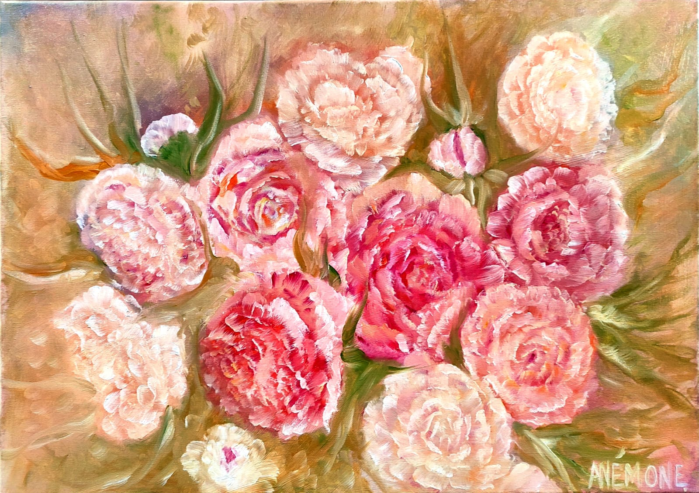
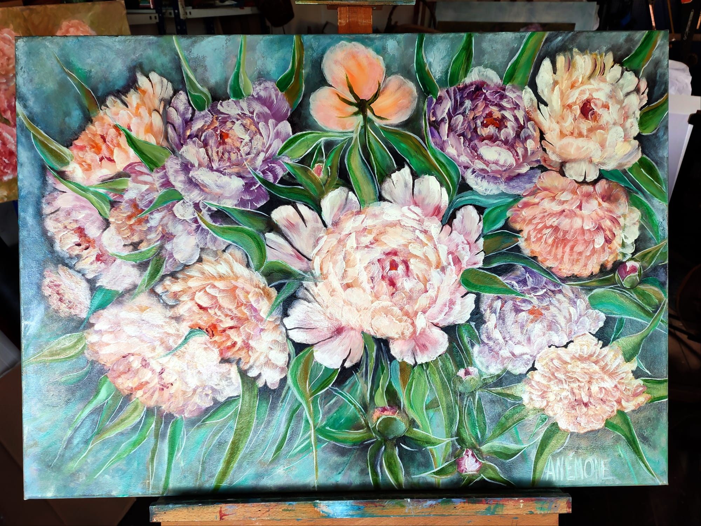
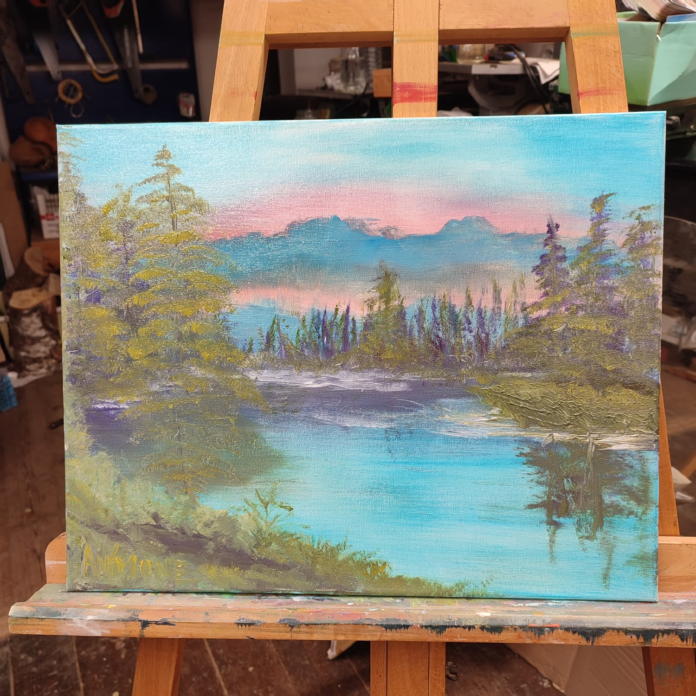

<html lang="en">
<head>
  <meta charset="UTF-8">
  <meta name="viewport" content="width=device-width, initial-scale=1.0">
  <title>My Paintings</title>
  
</head>
<body>
  <header>
    <h1>Anémone Reinhardt</h1>
    
Artiste peintre

  </header>
  

    

      
      <h3>"Fleurs", 2023, Huile sur toile</h3>
    

    

      
      <h3>"Fleurs", 2024, Huile sur toile</h3>
    

    

      
      <h3>"Paysage", 2024, Huile sur toile</h3>
    

    <!-- Add more paintings as needed -->
  

<footer>
  

    
Contactez-moi

    
Email: <a href="mailto:your-email@example.com">your-email@example.com</a>

    
Téléhone: <a href="tel:+1234567890">+123 456 7890</a>

  
  

</footer>

<!-- CSS for the Footer -->

  
</body>
</html>
